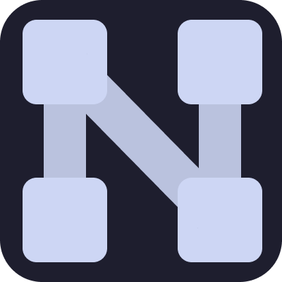

# Nodify

<p align="center">
  
</p>

Take your codebase understanding to the next level!
Nodify is a VSCode extension that visualizes the flow of execution through an entire program.
Using the power of AI, contributors and users alike can instantly grasp the architecture of any codebase.

## What is Nodify?

Nodify is a VSCode extension that generates high-level execution flow diagrams for any Python or TypeScript codebase. With Nodify, developers can instantly visualize interactions between different components with zero hassle. This living, interactable form of documentation grows alongside the software development process and makes use of the latest LLMs to provide intelligent summaries where applicable. Through Nodify’s autonomous diagram generation, engineers can see the progression of a codebase in real-time, catching design flaws long before they cause problems in published code.

As a productivity-focused tool, the goals of Nodify are as follows:

- Complete automation of the documentation process for execution flow diagrams.
- Interactable diagrams that can expand and contract based on level of desired detail.
- Zero interruptions and non-invasive implementation to the normal development workflow.

Check out our demo!

https://github.com/user-attachments/assets/1aa1e3a2-ddd6-4b8f-8064-ac431506dc18

# User Guide

## Accessing Nodify through VSCode Marketplace

_Note: if the extension through VSCode Marketplace does not work, please try the [debug mode](#accessing-nodify-locally-debug-mode)._

Nodify is available for free as a [VSCode extension](https://marketplace.visualstudio.com/items?itemName=nodify-dev.nodify). Complete the following steps to get started:

1. Open a Python or TypeScript project inside of VSCode (Nodify itself will work as a valid TypeScript project).
2. Navigate to the extensions menu (`CTRL+Shift+X`) and look for the `nodify` extension. Click install.
3. Use the command palette (`CTRL+Shift+P`) to pass in LLM details through the `Select LLM Server IP` and `Select LLM Model ID` commands. If using local LLMs, see the [local LLM Guide](#setting-up-ollama-for-local-llm-usage). The rest of this guide will continue by using OpenAI as the LLM service.

   1. After running `Select LLM Server IP`, choose the `https://api.openai.com` option.
   2. After running `Select LLM Model ID`, choose the `gpt-4o-mini` or `gpt-4o` option. We have also fine tuned gpt-4o-mini specifically for nodify. An API key can be provided on request

   _Note: Using OpenAI models requires a valid API key to be stored in the `OPENAI_API_KEY` environment variable. On Windows computers, this can be done through the [control panel](https://superuser.com/questions/949560/how-do-i-set-system-environment-variables-in-windows-10)._

   **Note 2: For capstone-related testing, we have prepared a proxy server at `https://model.nodify.dev` where the required API key is `OPENAI_API_KEY=nodify`. Please select `https://model.nodify.dev` when running the `Select LLM Server IP` and store the API key as an environment variable as described above.**

4. Navigate to the function definition you wish to start Nodify from and click on `Open Nodify at <func>`. A new window should appear with the Nodify loading logo until the first layers of the diagram are ready to render. When first running Nodify, this may take up to a few minutes. Nodify's own architecture can be visualized by opening this [repository](https://docs.google.com/document/d/1j3ipolHBj3V-nyrA8U-OOPp64l0-TTCFQrBqOX_N4Ss/edit?tab=t.0), navigating to `extension-v2/src/extension.ts` and running Nodify on the `activate` function.

   Alternatively, Nodify can start from any file in a codebase with the `Open Nodify Webview` command. This command should really be used only on `__main__.py` Python projects that do not use a starting function.

5. Use the arrow keys to navigate through the codebase using Nodify.
6. Enjoy!

## Setting Up Ollama for Local LLM Usage

A GPU with 16GB of VRAM is recommended for reasonable response times with local models. To set up local LLMs with Nodify, complete the following steps, then continue with step [4](#accessing-nodify-through-vscode-marketplace):

1. Install and start [Ollama](https://ollama.com/).
2. Run the `Select LLM Server IP` command in VSCode using 127.0.0.1. The specific port may vary from machine to machine, but 11434 is the default.
3. Download our custom trained model (based on phi 4 14B) to run locally through Ollama's CLI using:

```sh
ollama pull youcefb/nodify:Q4_K_M
```

4. After it's done downloading, select the model name from the drop down of the `Select LLM Model ID` command.

Nodify will take significantly longer on startup for local LLMs, since Ollama must first load the entire model into GPU memory.

## Accessing Nodify Locally (Debug Mode)

In the event that the VSCode marketplace version of Nodify is broken, Nodify can be built from source:

1. Download this repo and install [bun](https://bun.sh/docs/installation). Also install [yarn](https://classic.yarnpkg.com/lang/en/docs/install/#windows-stable)
2. Run `bun install` on the `extension-v2`, `extension-v2/src` and `extension-v2/webview-ui` folders.
3. Press F5 with `extension-v2` open in VSCode.

# Project Details

## Why Nodify?

Nodify can instantly generate interactive up-to-date flowchart documentation from any Python or TypeScript codebase, virtually eliminating the drawbacks of creating visual aids for communicating programs. Contributors and users alike will be able to instantly grasp the high-level functionality of any program. Additionally, in approaching this problem with a non-invasive stance, our project can run anywhere, anytime, even on incomplete code. Nodify can even provide retroactive documentation for undocumented projects, generating flow charts to easily conceptualize different components of a program. As a result, users of Nodify should expect much less frustration and wasted time when working with foreign or familiar projects.

## Results

On small-to-medium sized projects using GPT-4o, Nodify provided intuitive, clear graphs of an entire codebase within a few seconds. Further, collapsible nodes and a collision-avoidance pathing algorithm within the graph allowed for reasonable simplification and organization of complex diagrams respectively. As part of Nodify’s goal for a zero-interruption workflow, we experimented with a custom fine-tuned model to run Nodify on local GPUs. Hardware quality, specifically GPU VRAM, was one of the largest limiting factors for local LLMs, preventing the use of higher quality models or requiring prohibitively longer running times on larger codebases.

Overall, weaker generic models tended to create more code partitions with slightly inaccurate summarizations, reducing the effectiveness of Nodify as a high-level analysis tool. Likewise, even after mechanically decomposing blocks of code into smaller chunks and using the best models available (Claude 3, GPT-4o, etc.), some very large-scale Python projects struggled to translate well into Nodify diagrams, requiring significant amounts of processing time or providing oversimplified summaries of the project.

## What’s Next for Nodify?

As LLMs become better at summarization and semantic textual analysis, Nodify’s diagram output will also continue to provide higher quality information. Currently, Nodify mirrors programs by converting project source code into high-level flow graphs, but this concept can be feasibly reversed. That is, instead of writing code and visualizing the resulting architecture, AI may be able to generate programs from high-level models of a software project. Tools like GitHub Copilot and Cursor already exist to generate code to a certain degree, but often require detailed prompts, comprehensive context, and low-level requirements analysis to prevent hallucination. Instead, Nodify users will be able to prototype a project fully in the graphical node editor, with AI agents applying design changes directly to a codebase when requested.

## Background

Professional software engineering teams often make use of hand-drawn diagrams and flowcharts to document the high-level architecture of a large project. Concrete visual aids of this nature are especially useful at reducing the mental strain and onboarding time for new developers, accelerating codebase proficiency and increasing overall productivity within the team. However, such flowcharts must be created and updated manually, quickly becoming dated and unmaintainable as agile project requirements inevitably change. Therefore, Nodify seeks to automate this diagram-creation process to better serve developers in debugging, documenting, and understanding their projects.

# Contribution Guide

To run Nodify from source, see the [above guide](#accessing-nodify-locally-debug-mode)

## Publishing the Extension

Following the guide [here](https://code.visualstudio.com/api/working-with-extensions/publishing-extension), run the following commands:

```Powershell
cd extension-v2
vsce package
vsce publish
```

If the steps below do not work, check the personal access token status used to login to vsce and [nodify-dev](https://dev.azure.com/nodify-dev/) organization membership.
